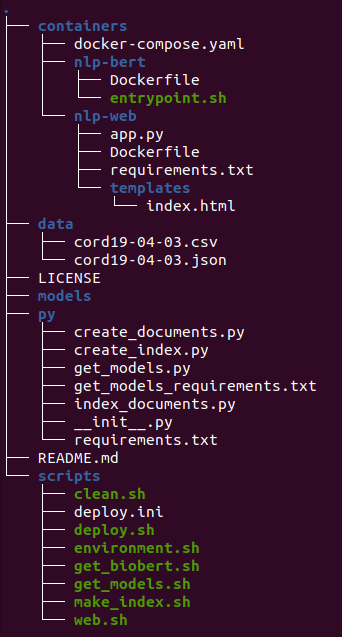
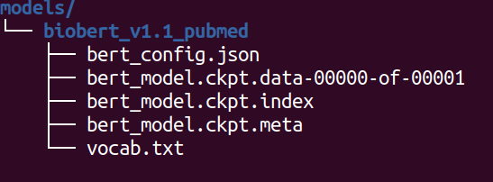
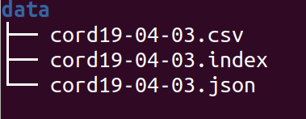

# Covid-19 Search Engine

##### This project aims to help researchers in the fight against Covid-19 by providing relevant articles that match queries written in natural language.
It is available here:  [Covid-19 Search Engine](https://covid.exact-lab.it/ "Covid-19 Search Engine").

**Covid-19 Search Engine** is based on BioBERT [1] to search relevant content inside the [CORD-19](https://pages.semanticscholar.org/coronavirus-research) dataset, which  include more than 44,000 scholarly articles about COVID-19, SARS-CoV-2 and related coronaviruses.

> ⚠️ This project development is now halted as we are planning to release a new version together with another team at [covid-papers-browser](https://github.com/gsarti/covid-papers-browser). 
We will continue to release csv and index files with the new updates from the CORD-19 dataset.

This project is composed of three docker containers:

- **`nlp-web`**, the frontend Flask application to be used by users

- **`nlp-bert`**,  which contains the BERT model that  encodes queries and create the corpus

- **`nginx`**, that contains the BERT dashboard

- **`nlp-elasticsearch`**, that store the index of documents and serve them to the Flask app

In a nutshell,  BERT encodes all documents of the corpus based on the abstract. This information together with **Title, Abstract, Authors, DOI** are saved in a index  and than stored in elasticsearch.
Users queries are encoded on the fly by BERT and then confronted with the stored embeddings from the index.
For more information on how these components work together, please see the references.[2]

Below the structure of this repository:




## Setup

`docker` and ` docker-compose` are required to run this code with models on CPU.

### Run on GPU
In orderd to run on GPUs,  `docker-compose`  need `nvidia-runtime` compatibility.
The script **environment.sh** will install this packets for Ubuntu ( tested on 19.04)  to run models on GPUs.
For other distros, please see https://github.com/NVIDIA/nvidia-docker for further information.
In order to spin up containers with GPUs, uncomment the following line of code on
**containers/docker-compose.yaml**:

```
  nlp-bert:
    build: ./nlp-bert
#    runtime: nvidia
    environment:
    ports:
      - "8001:8001"
      - "5555:5555"
      - "5556:5556"
    environment:
      - PATH_MODEL=${PATH_MODEL}
#      - NVIDIA_VISIBLE_DEVICES=all
    volumes:
      - "${PATH_MODEL}:/model"
```
Than change the first line of **containers/nlp-bert/Dockerfile** to use TensorFlow GPU:
```
FROM tensorflow/tensorflow:1.12.0-gpu-py3

```

Finally edit **containers/nlp-bert/entrypoint.sh** to this:
```
bert-serving-start -num_worker 1 -device_map 0  -max_seq_len 128  -model_dir /model -http_port 8001
```
This will start the bert container using your first GPU device. To use more than one GPU change num_workers and device_map accordingly. For example:
```
bert-serving-start -num_worker 2 -device_map 0,1  -max_seq_len 128  -model_dir /model -http_port 8001
```
Will run on the first two GPUs from $NVIDIA_VISIBLE_DEVICES.


### Python requirements


Python 3.6 or higher is required to run the code. The dependencies will be installed automatically by **make_index.sh**.  Alternatively, they can be installed  manually with:

```shell
pip install -r py/requirements.txt
```
## Downloading models
We used the Biobert pretrained model to better match the style of writing of the articles,
that is a version of BERT fine tuned over more than 1 million of pubmed pubblications.
For more information see [BioBERT Github](https://github.com/dmis-lab/biobert).
To download it just run **scripts/get_biobert.sh**
It will download and extract biobert inside the **models** folder:




### Using Models  from Transformers
**`transformers`  needs a lot of requirements which are in a separate file called /py/get_models_requirements.txt**
Everything is installed the first time you run **get_models.sh**.
Browse a pretrained model from HuggingFace cloud repository, for example **monologg/kobert** and download it with:

```shell
python scripts/get_model.sh --model monologg/kobert
```
This script will download the choosen model,  convert its format to TensorFlow and save it in the models folder. Remember that this infrastructure support only BERT models.


## How to run
**All the scripts are expected to run from within scripts/ folder.**

### Start the containers
In order to have the website up and running just run **deploy.sh**:
```
cd scripts; ./deploy.sh
```
**deploy.ini** contains the parameters used for the index name and for the model used:
```
export BASE_DIR="$(cd .. ; pwd -P )"
export PATH_MODEL="$BASE_DIR/models/biobert_v1.1_pubmed"
export INDEX_NAME="covid19_04-03"
```
Download the precompiled index file for the example above under [releases](https://github.com/t0m-R/covid19-search-engine/releases) and put it inside the data folder:



### Load corpus into elasticsearch
Run **index_documents.py** to load the documents into elasticsearch:
```
python py/index_documents.py --index_name=covid19_04-10
```
Now everything should work and the website should return queries to the user.

### Build index manually
Alternatively you can manually build an index and load it to elasticsearch with **make_index.sh**:
```
./make_index.sh cord19-04-03.json
```
It needs the name of the json config file for the index, found in **data/**, it expects to find there also the csv file with the same name.

## Utils

- **web.sh** copy index.html inside nlp-web container, in order to see changes on the fly
- **clean.sh** deletes images for nlp-web and nlp-bert


### Credits
We would like to express our gratitude towards  [eXact Lab](https://www.exact-lab.it/), that gave us the possibility to host our website for free.

Special thanks for the work of Hironsan, ([Github](https://github.com/Hironsan/bertsearch))  that gave us the idea to build this service.

## References
[1] Lee et al. 2020, ["BioBERT: a pre-trained biomedical language representation model for biomedical text mining"](http://doi.org/10.1093/bioinformatics/btz682)

[2]Elasticsearch meets BERT: Building Search Engine with Elasticsearch and BERT https://towardsdatascience.com/elasticsearch-meets-bert-building-search-engine-with-elasticsearch-and-bert-9e74bf5b4cf2
